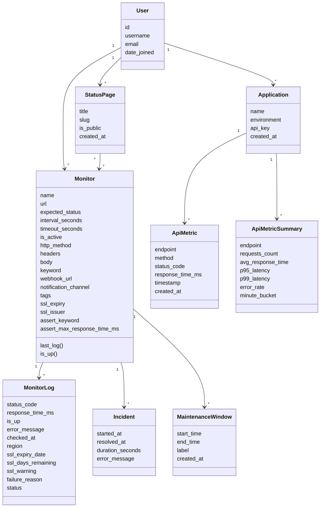
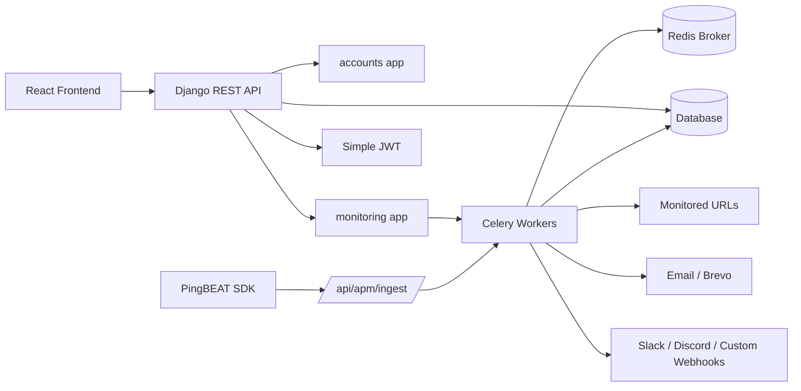
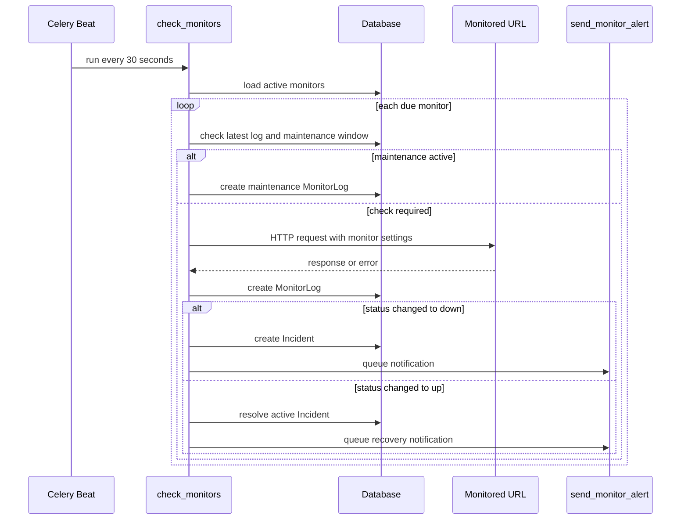
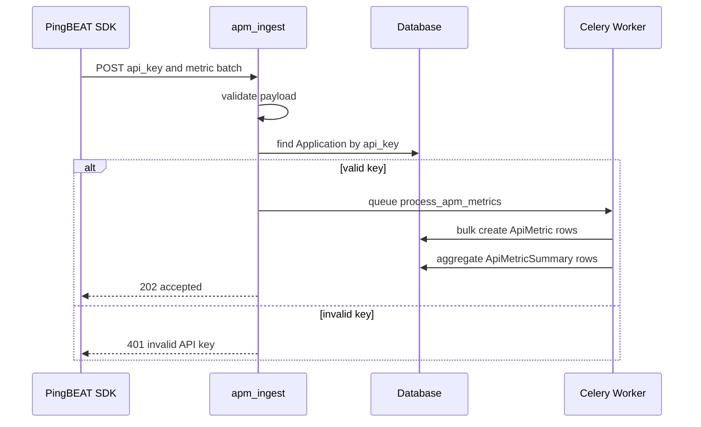
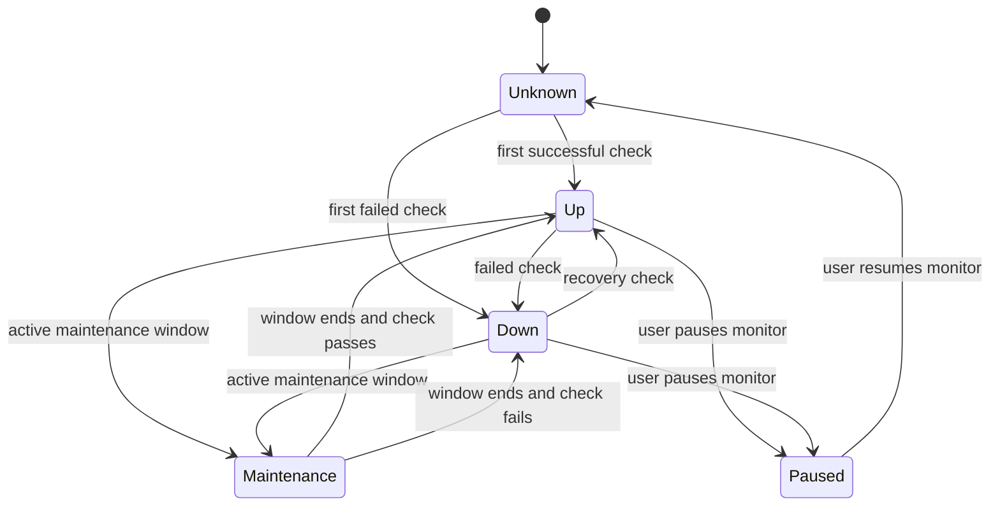
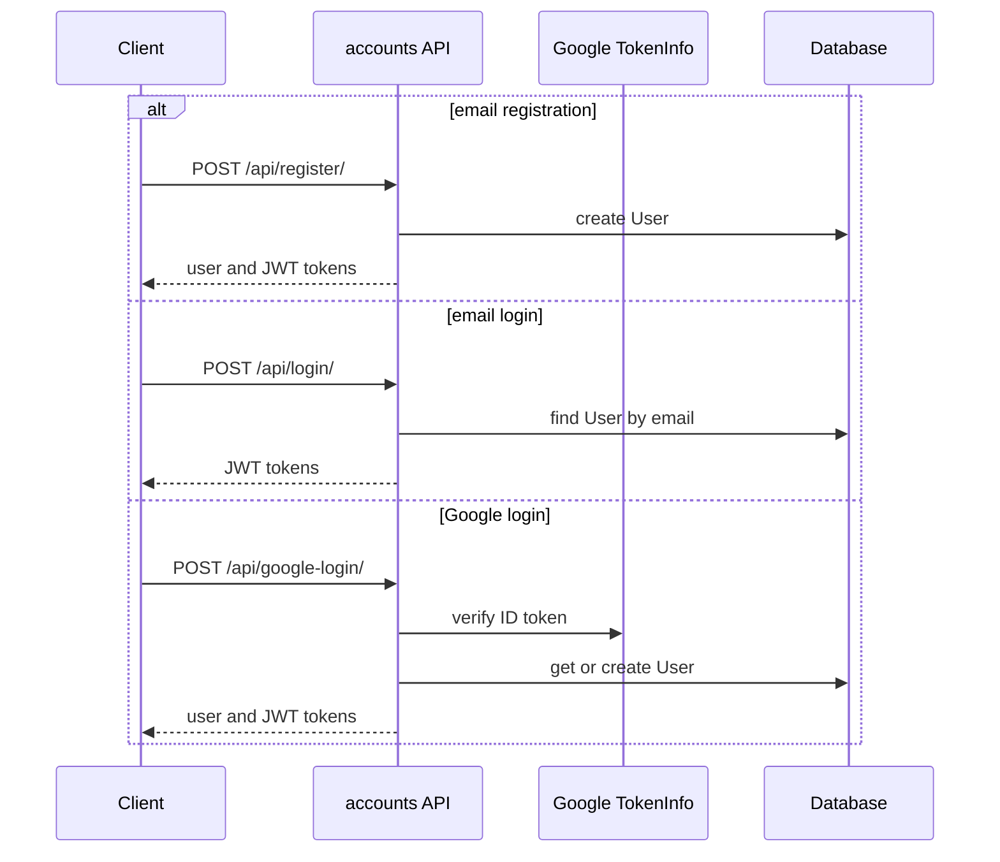

# Backend UML Diagrams

## Structural Diagram





## Behavioral Diagrams

### Monitor Check Flow



### Local APM Development

```env
PINGBEAT_APM_LOCAL_CAPTURE=True
PINGBEAT_APM_SYNC_INGEST=True
PINGBEAT_APM_FLUSH_INTERVAL_SECONDS=10
APM_INGEST_RATE_LIMIT=1000
APM_METRIC_RETENTION_DAYS=7
```

### APM Ingest Flow



### Monitor State



### Auth Flow


