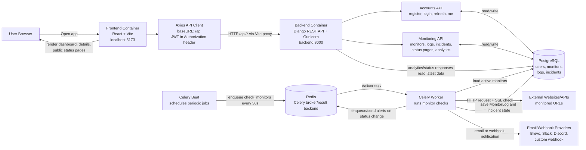

# 🏓 PingBEAT — Simple Uptime Monitoring

PingBEAT is a simple, self-hosted uptime monitoring platform. Create HTTP monitors, and PingBEAT checks them every minute — logging response times, status codes, and UP/DOWN status.

## Tech Stack

| Layer      | Technology                          |
|------------|-------------------------------------|
| Frontend   | React 18 + Vite + TailwindCSS      |
| Backend    | Django 5 + Django REST Framework    |
| Auth       | JWT (djangorestframework-simplejwt) |
| Database   | PostgreSQL 16                       |
| Broker     | Redis 7                             |
| Task Queue | Celery + Celery Beat                |
| Containers | Docker + Docker Compose             |

## Block Diagram Architecture



## Frontend and Backend Interaction

1. The browser opens the React app at `http://localhost:5173`.
2. React calls functions in `frontend/src/services/api.js`, such as `login`, `getMonitors`, `createMonitor`, and `getAnalytics`.
3. Axios sends requests to `/api/...`. In development/Docker, Vite proxies those requests to the Django backend.
4. Django handles `/api/register/`, `/api/login/`, `/api/monitors/`, `/api/logs/`, `/api/status-pages/`, `/api/analytics/`, and related routes.
5. Protected API calls use a JWT access token from `localStorage` in the `Authorization: Bearer <token>` header.
6. Django REST Framework validates the request, applies user permissions, and reads/writes PostgreSQL.
7. The frontend receives JSON responses and updates the dashboard, monitor detail pages, analytics, and status pages.

## Background Monitoring Flow

1. Celery Beat schedules `monitoring.tasks.check_monitors` every 30 seconds.
2. Redis stores the queued Celery task.
3. A Celery worker picks up the task, reads active monitors from PostgreSQL, and checks each due monitor.
4. The worker sends HTTP requests to the monitored URL, checks status code, response time, keyword assertions, SSL expiry, and maintenance windows.
5. Results are saved as `MonitorLog` rows. Downtime/recovery transitions create or resolve `Incident` rows.
6. If alerts are enabled, the worker sends email or webhook notifications.
7. The frontend later reads these saved results through the Django API.

## Quick Start (Docker)

### Prerequisites

- [Docker](https://docs.docker.com/get-docker/) & Docker Compose

### Run

```bash
docker compose up --build
```

That's it! Once all services are up:

| Service   | URL                        |
|-----------|----------------------------|
| Frontend  | http://localhost:5173       |
| Backend   | http://localhost:8000       |
| Admin     | http://localhost:8000/admin |

### Create a superuser (optional)

```bash
docker compose exec backend python manage.py createsuperuser
```

## Manual Setup (Without Docker)

### Prerequisites

- Python 3.12+
- Node.js 20+
- PostgreSQL 16+
- Redis 7+

### Backend

```bash
cd backend

# Create virtual environment
python -m venv venv
source venv/bin/activate  # On Windows: venv\Scripts\activate

# Install dependencies
pip install -r requirements.txt

# Set environment variables (or use defaults)
export DB_NAME=pingbeat
export DB_USER=postgres
export DB_PASSWORD=postgres
export DB_HOST=localhost
export DB_PORT=5432
export REDIS_URL=redis://localhost:6379/0

# Run migrations
python manage.py migrate

# Start server
python manage.py runserver
```

### Celery (in separate terminals)

```bash
# Worker
celery -A config worker --loglevel=info -P threads -c 8

# Beat (periodic tasks)
celery -A config beat --loglevel=info
```

### Frontend

```bash
cd frontend

# Install dependencies
npm install

# Start dev server
npm run dev
```

## API Endpoints

### Authentication

| Method | Endpoint             | Description          |
|--------|----------------------|----------------------|
| POST   | `/api/register/`     | Register new user    |
| POST   | `/api/login/`        | Login (get JWT)      |
| POST   | `/api/logout/`       | Logout (blacklist)   |
| POST   | `/api/token/refresh/`| Refresh access token |
| GET    | `/api/me/`           | Current user info    |

### Monitors

| Method | Endpoint                       | Description        |
|--------|--------------------------------|--------------------|
| GET    | `/api/monitors/`               | List monitors      |
| POST   | `/api/monitors/`               | Create monitor     |
| GET    | `/api/monitors/:id/`           | Get monitor        |
| PUT    | `/api/monitors/:id/`           | Update monitor     |
| DELETE | `/api/monitors/:id/`           | Delete monitor     |
| POST   | `/api/monitors/:id/pause/`     | Pause monitor      |
| POST   | `/api/monitors/:id/resume/`    | Resume monitor     |

### Logs

| Method | Endpoint                       | Description        |
|--------|--------------------------------|--------------------|
| GET    | `/api/logs/`                   | List all logs      |
| GET    | `/api/logs/?monitor_id=:id`    | Logs for a monitor |

### Application Performance Monitoring

| Method | Endpoint                       | Description                 |
|--------|--------------------------------|-----------------------------|
| POST   | `/api/apm/ingest/`             | SDK batch metric ingestion  |
| GET    | `/api/apm/applications/`       | List APM applications       |
| POST   | `/api/apm/applications/`       | Register APM application    |
| GET    | `/api/apm/applications/:id/`   | Get APM application         |
| GET    | `/api/apm/analytics/`          | APM overview metrics        |
| GET    | `/api/apm/endpoints/`          | Endpoint analytics          |
| GET    | `/api/apm/traffic/`            | Traffic trend data          |
| GET    | `/api/apm/errors/`             | Error breakdowns            |

The React dashboard is available at `/apm`. Full APM architecture, SDK design, ER diagram, API examples, Celery workflow, scaling strategy, security notes, deployment architecture, and roadmap are documented in [`docs/APM_ARCHITECTURE.md`](docs/APM_ARCHITECTURE.md).

#### Using PingBEAT APM inside this Django project

PingBEAT now includes a lightweight Django APM middleware at `backend/config/pingbeat_apm.py`.

It automatically captures:

- API endpoint path
- HTTP method
- status code
- response time
- timestamp

It sends metrics in batches every 30 seconds to:

```txt
/api/apm/ingest/
```

To enable it, first create an APM application from the dashboard:

```txt
APM → Register Application
```

Copy the generated API key, then set these environment variables.

Local backend:

```powershell
cd backend
$env:PINGBEAT_APM_API_KEY="pb_your_generated_key"
$env:PINGBEAT_APM_INGEST_URL="http://localhost:8000/api/apm/ingest/"
python manage.py runserver
```

Docker:

```powershell
$env:PINGBEAT_APM_API_KEY="pb_your_generated_key"
$env:PINGBEAT_APM_INGEST_URL="http://backend:8000/api/apm/ingest/"
docker compose up --build
```

On macOS/Linux, use `export PINGBEAT_APM_API_KEY=...` instead.

The middleware is already registered in `backend/config/settings.py`:

```python
MIDDLEWARE = [
    ...
    'config.pingbeat_apm.PingBeatAPMMiddleware',
    ...
]
```

After traffic hits your API endpoints, wait up to 30 seconds, then open:

```txt
/apm
```

You will see endpoint-level APM data such as `/api/login/`, `/api/monitors/`, response time, request count, latency, and errors.

Do not place the API key in frontend code. Keep it in backend environment variables only.

## Project Structure

```
PinBEAT/
├── backend/
│   ├── config/          # Django settings, URLs, Celery
│   ├── accounts/        # User auth (register, login, me)
│   ├── monitoring/      # Monitors, logs, Celery tasks
│   ├── manage.py
│   ├── requirements.txt
│   └── Dockerfile
├── frontend/
│   ├── src/
│   │   ├── pages/       # Login, Register, Dashboard, etc.
│   │   ├── components/  # Navbar, ProtectedRoute
│   │   └── services/    # Axios API client
│   ├── package.json
│   └── Dockerfile
├── docker-compose.yml
└── README.md
```

## How It Works

1. **Create a monitor** — specify a URL, expected status code, and check interval
2. **Celery Beat** runs `check_monitors` every 60 seconds
3. For each active monitor, a **Celery worker** sends an HTTP GET request
4. Results (status code, response time, UP/DOWN) are saved as **monitor logs**
5. The **dashboard** shows real-time status of all your monitors

## License

MIT
