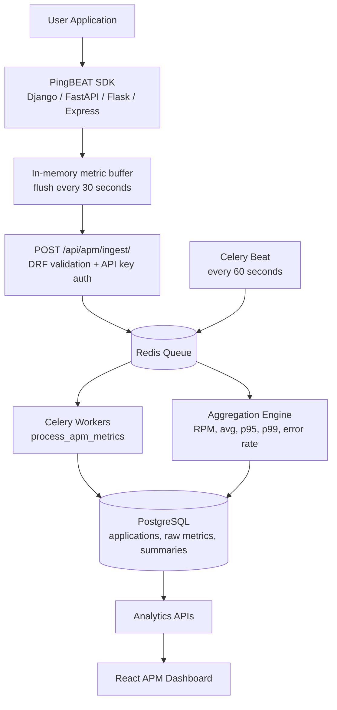
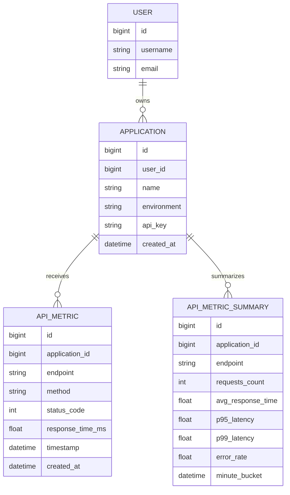
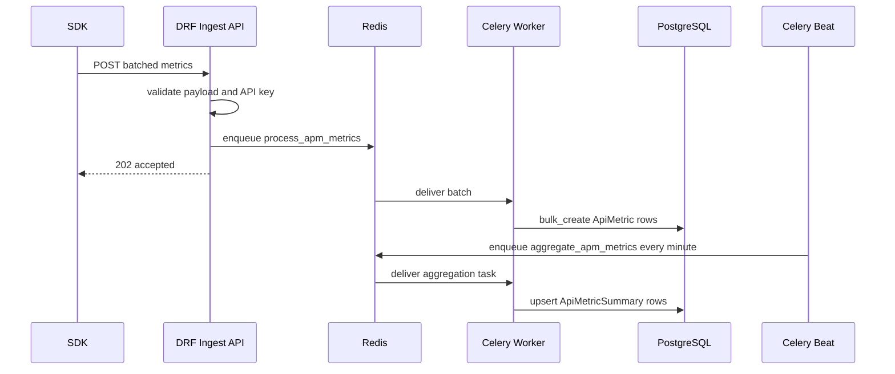
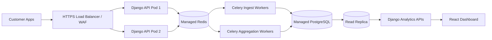

# PingBEAT APM Architecture

This design keeps the first APM version lightweight: SDKs batch HTTP request metrics, Django validates the application API key, Celery persists the batch, and Celery Beat aggregates raw rows into minute summaries for dashboard APIs.

## 1. Complete System Architecture



Request flow: application request finishes, SDK records endpoint, method, status code, latency, and timestamp.

Queue flow: SDK sends one batch, ingestion validates the API key and payload, then queues `process_apm_metrics`.

Aggregation flow: Celery Beat runs `aggregate_apm_metrics` every minute and upserts recent minute buckets.

Dashboard flow: React reads summary APIs for overview cards, traffic, endpoints, latency, and errors.

## 2. Database Schema



Important indexes:

- `Application.api_key` unique index for ingestion lookup.
- `ApiMetric(application, timestamp)` for time-window reads.
- `ApiMetric(application, endpoint, timestamp)` for endpoint analytics.
- `ApiMetricSummary(application, minute_bucket)` for dashboard trends.
- Unique summary bucket: `application + endpoint + minute_bucket`.

## 3. API Specifications

All endpoints except ingestion require JWT auth.

### POST `/api/apm/applications/`

Request:

```json
{
  "name": "Billing API",
  "environment": "production"
}
```

Response:

```json
{
  "id": 1,
  "name": "Billing API",
  "environment": "production",
  "api_key": "pb_xxxxx",
  "created_at": "2026-01-01T12:00:00Z",
  "metrics_count": 0
}
```

### GET `/api/apm/applications/`

Response:

```json
[
  {
    "id": 1,
    "name": "Billing API",
    "environment": "production",
    "api_key": "pb_xxxxx",
    "created_at": "2026-01-01T12:00:00Z",
    "metrics_count": 1200
  }
]
```

### GET `/api/apm/applications/:id/`

Response: one application object.

### POST `/api/apm/ingest/`

Request:

```json
{
  "api_key": "pb_xxxxx",
  "metrics": [
    {
      "endpoint": "/api/orders",
      "method": "GET",
      "status_code": 200,
      "response_time_ms": 145,
      "timestamp": "2026-01-01T12:00:00Z"
    }
  ]
}
```

Response:

```json
{
  "status": "accepted",
  "application_id": 1,
  "queued_metrics": 1
}
```

### GET `/api/apm/analytics/?application_id=1&hours=24`

Response:

```json
{
  "total_requests": 25000,
  "average_response_time": 138.4,
  "error_rate": 1.2,
  "active_applications": 3,
  "p95_latency": 420.0,
  "p99_latency": 890.0
}
```

### GET `/api/apm/endpoints/?application_id=1&hours=24`

Response:

```json
[
  {
    "endpoint": "/api/orders",
    "requests_count": 12000,
    "avg_response_time": 145.2,
    "p95_latency": 410.0,
    "p99_latency": 760.0,
    "error_rate": 0.8
  }
]
```

### GET `/api/apm/traffic/?application_id=1&hours=24`

Response:

```json
[
  {
    "timestamp": "2026-01-01T12:00:00Z",
    "requests_count": 180,
    "avg_response_time": 141.7,
    "error_rate": 1.1
  }
]
```

### GET `/api/apm/errors/?application_id=1&hours=24`

Response:

```json
{
  "total_errors": 42,
  "by_status_code": [
    { "status_code": 500, "count": 30 }
  ],
  "top_error_endpoints": [
    { "endpoint": "/api/orders", "count": 12 }
  ]
}
```

## 4. SDK Design

Package names:

- Python: `pip install pingbeat-agent`
- Node.js: `npm install pingbeat-agent`

SDK configuration:

```python
PINGBEAT_API_KEY = "pb_xxxxx"
PINGBEAT_INGEST_URL = "https://app.pingbeat.com/api/apm/ingest/"
PINGBEAT_FLUSH_INTERVAL_SECONDS = 30
```

Shared SDK behavior:

1. Capture start time before request handling.
2. Capture endpoint, method, status code, response time, and timestamp after response.
3. Push metric to an in-memory buffer.
4. Flush every 30 seconds, or sooner when buffer reaches a max size such as 500.
5. Send one JSON payload with many metrics.
6. Drop or retry with bounded backoff if PingBEAT is unavailable.

Python batcher shape:

```python
class PingBeatClient:
    def __init__(self, api_key, ingest_url, flush_interval=30):
        self.api_key = api_key
        self.ingest_url = ingest_url
        self.flush_interval = flush_interval
        self.buffer = []

    def capture(self, metric):
        self.buffer.append(metric)

    def flush(self):
        if not self.buffer:
            return
        batch = self.buffer[:]
        self.buffer.clear()
        requests.post(self.ingest_url, json={"api_key": self.api_key, "metrics": batch}, timeout=5)
```

Django middleware:

```python
class PingBeatMiddleware:
    def __init__(self, get_response):
        self.get_response = get_response

    def __call__(self, request):
        started = time.perf_counter()
        response = self.get_response(request)
        client.capture({
            "endpoint": request.path,
            "method": request.method,
            "status_code": response.status_code,
            "response_time_ms": round((time.perf_counter() - started) * 1000, 2),
            "timestamp": datetime.now(timezone.utc).isoformat()
        })
        return response
```

FastAPI middleware:

```python
@app.middleware("http")
async def pingbeat_middleware(request, call_next):
    started = time.perf_counter()
    response = await call_next(request)
    client.capture({
        "endpoint": request.url.path,
        "method": request.method,
        "status_code": response.status_code,
        "response_time_ms": round((time.perf_counter() - started) * 1000, 2),
        "timestamp": datetime.now(timezone.utc).isoformat()
    })
    return response
```

Flask hook:

```python
@app.before_request
def pingbeat_start():
    g.pingbeat_started = time.perf_counter()

@app.after_request
def pingbeat_finish(response):
    client.capture({
        "endpoint": request.path,
        "method": request.method,
        "status_code": response.status_code,
        "response_time_ms": round((time.perf_counter() - g.pingbeat_started) * 1000, 2),
        "timestamp": datetime.now(timezone.utc).isoformat()
    })
    return response
```

Express middleware:

```js
function pingbeatMiddleware(client) {
  return function (req, res, next) {
    const started = process.hrtime.bigint()
    res.on('finish', () => {
      const elapsedMs = Number(process.hrtime.bigint() - started) / 1_000_000
      client.capture({
        endpoint: req.route?.path || req.path,
        method: req.method,
        status_code: res.statusCode,
        response_time_ms: Math.round(elapsedMs * 100) / 100,
        timestamp: new Date().toISOString()
      })
    })
    next()
  }
}
```

## 5. Celery Workflow



## 6. Analytics Pipeline

Raw metric:

```json
{
  "application": "Billing API",
  "endpoint": "/api/orders",
  "method": "GET",
  "status_code": 200,
  "response_time_ms": 145,
  "timestamp": "2026-01-01T12:00:00Z"
}
```

Minute aggregation:

- Requests per minute: count raw rows per application, endpoint, minute.
- Average response time: average `response_time_ms`.
- Error rate: `5xx_count / total_count * 100`.
- P95 latency: nearest-rank 95th percentile.
- P99 latency: nearest-rank 99th percentile.

The current task recomputes the recent 10-minute window. That is simple and handles late batches. At higher scale, replace the Python grouping with PostgreSQL time-bucket queries, TimescaleDB continuous aggregates, ClickHouse, or a stream processor.

## 7. Dashboard Wireframe

```text
+--------------------------------------------------------------------------------+
| Navbar: Dashboard | Analytics | APM | Status Pages                              |
+--------------------------------------------------------------------------------+
| Application Performance                 [Application Filter] [Time Range]       |
+----------------------------+---------------------------------------------------+
| Register Application       | Applications                                      |
| Name                       | Billing API / production / pb_xxxxx [Copy]        |
| Environment                | Checkout API / staging / pb_xxxxx [Copy]          |
| [Create Application]       |                                                   |
+----------------------------+---------------------------------------------------+
| Total Requests | Avg Response Time | Error Rate | Active Applications           |
+--------------------------------------------------------------------------------+
| Traffic Over Time                                         | Latency Distribution |
| Requests per minute bars                                  | P95 / P99 / Errors   |
+--------------------------------------------------------------------------------+
| Top Endpoints                          | Slowest Endpoints                         |
+--------------------------------------------------------------------------------+
| Error Breakdown: by status code and endpoint                                      |
+--------------------------------------------------------------------------------+
```

Application detail modules:

- Endpoint Analytics
- Request Distribution
- Latency Distribution
- Error Breakdown
- Traffic Over Time
- Response Time Trends

## 8. Scaling Strategy

Ingestion:

- Keep `/api/apm/ingest/` stateless so it can run behind a load balancer.
- Rate limit per API key.
- Cap SDK batch size. Current backend limit is 1000 metrics per request.
- Return `202 Accepted` quickly after queueing.

Queue:

- Use dedicated Celery queue names for APM ingest and aggregation at scale.
- Run separate worker pools for ingest and aggregation.
- Tune worker concurrency based on DB write capacity.

Storage:

- Partition raw metrics by day or month.
- Retain raw metrics for a short window, for example 7 to 30 days.
- Retain summaries longer, for example 6 to 24 months.
- Consider TimescaleDB or ClickHouse when raw metrics become very large.

Analytics:

- Read dashboards from summary tables, not raw metric tables.
- Cache high-traffic dashboard responses for 30 to 60 seconds.
- Precompute endpoint rankings.

## 9. Security Considerations

- Treat SDK API keys like secrets.
- Hash API keys at rest in a future migration if external exposure risk increases.
- Rotate API keys from the dashboard.
- Scope ingestion keys to one application.
- Do not allow SDK keys to call authenticated dashboard APIs.
- Validate payload size, field types, status code range, and timestamp format.
- Add per-key rate limits and abuse detection.
- Use HTTPS only in production.
- Avoid collecting request bodies, headers, tokens, cookies, or PII by default.

## 10. Production Deployment Architecture



Recommended SaaS deployment:

- Django API: horizontally scaled containers.
- Celery workers: separate deployments for monitor checks, APM ingest, and APM aggregation.
- Redis: managed Redis with persistence and alerts.
- PostgreSQL: managed PostgreSQL with backups, read replicas, and partitioning.
- Observability: instrument PingBEAT itself with logs, metrics, traces, and queue depth alerts.
- Secrets: store database URLs, Redis URLs, JWT signing keys, and email provider keys in a secret manager.

## Future Roadmap

- OpenTelemetry support: accept OTLP HTTP metrics and traces.
- Distributed tracing: trace IDs, span IDs, parent-child spans, service maps.
- Database query monitoring: ORM query duration and slow query capture.
- Redis monitoring: command latency, error count, cache hit rate.
- Container monitoring: CPU, memory, restarts, network, filesystem.
- Kubernetes monitoring: pod health, deployment rollout state, node pressure.
- Full observability platform: logs, metrics, traces, incidents, SLOs, alert routing, and status pages in one product.
